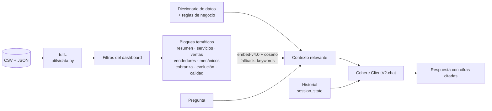

# AutoPulse Analytics

**Dashboard de analytics + asistente IA (RAG) para una empresa que vende autos a comisión y opera un taller de servicios.**

Python · pandas · Streamlit · Plotly · Cohere (embeddings + chat API v2)

> [!NOTE]
> **Todos los datos son sintéticos.** AutoPulse es una empresa ficticia. Los CSV se generan con
> `scripts/generar_datos.py` (Faker `es_AR`, semilla fija) y no hay credenciales, datos de clientes reales
> ni conexiones a fuentes privadas. La arquitectura replica un dashboard productivo que construí sobre
> Google Sheets para un negocio real, con dominio y datos reemplazados.

<!-- Reemplazar por un GIF corto del recorrido: Reporte General → Asistente IA -->


---

## El problema

Una pyme con dos unidades de negocio que registra todo a mano en planillas:

1. **Venta de autos a comisión.** La factura del vehículo pasa por la empresa, pero su ingreso real es la comisión (3–8 %).
2. **Taller de servicios** (lavado, detailing, mecánica, chapa y pintura, alineación). Acá lo facturado sí es ingreso.

Las preguntas del dueño son simples ("¿cuánto gané este año?", "¿cuánto me deben?", "¿qué mecánico está sobrecargado?"),
pero la respuesta no lo es:

- Si sumás facturas de autos y de taller, el negocio parece ~13 veces más grande de lo que es y el taller parece irrelevante.
- Una celda dice `"Corolla Cross, Yaris"` con una sola factura. ¿Cuánto vendiste de cada modelo?
- Una orden la hicieron tres mecánicos en paralelo. ¿Cuántas horas trabajó el taller?
- Hay montos vacíos en órdenes "cobradas", fechas con el año mal tipeado y nombres escritos de tres formas distintas.

AutoPulse Analytics resuelve eso con un ETL explícito y testeado, un dashboard que muestra cada número con su definición,
y un asistente que responde en lenguaje natural citando las cifras en las que se basa.

## Qué incluye

| Página | Qué muestra |
|---|---|
| **📊 Reporte General** | Ingreso AutoPulse (servicios + comisiones) separado del volumen intermediado, participación por unidad, evolución mensual, estado de cobranza. |
| **🔧 Servicios de Taller** | Ingreso por servicio y por vehículo, top clientes, estacionalidad, trabajo por mecánico (horas, solo vs. acompañado). |
| **🚙 Venta de Autos** | Unidades por modelo, facturación prorrateada, modelos *pendientes de precio*, comisiones cobradas vs. por cobrar, ranking de vendedores, formas de pago y canales de lead. |
| **💬 Asistente IA** | Chat sobre los datos filtrados con RAG sobre Cohere. Sin API key funciona en **modo demo** con respuestas reales precalculadas. |
| **🧪 Calidad de Datos** | Perfilado de cada archivo (dtype, % nulos, únicos, ejemplos) y alertas: cobrado sin monto, fechas fuera de rango, modelos sin precio, formatos inconsistentes. |

Los filtros globales (período y estado del servicio) viven en la barra lateral y aplican a todas las páginas, asistente incluido.

<table>
  <tr>
    <td></td>
    <td></td>
  </tr>
  <tr>
    <td></td>
    <td></td>
  </tr>
</table>

---

## Decisiones de diseño

### 1. Comisión ≠ facturación

Es la asimetría central del modelo de datos, y el dashboard la hace explícita en vez de esconderla:

| | Servicios de taller | Venta de autos |
|---|---|---|
| **Ingreso** | `monto_total` | `comision_monto` |
| **Volumen** | `monto_total` | `factura_sin_iva` |

- **KPI principal:** `Ingreso AutoPulse = Σ monto_total (taller) + Σ comision_monto (autos)`.
- **KPI secundario:** `Volumen intermediado = Σ factura_sin_iva`. Se muestra aparte, no suma al ingreso y no entra en la participación por unidad.
- Cada métrica tiene un `help=` con su definición, y hay un desplegable "¿Por qué el volumen intermediado no es ingreso?".

Con los datos de ejemplo, el volumen intermediado es ~US$ 1,8 M contra ~US$ 133 k de ingreso real. Mezclarlos cambiaría
todas las conclusiones del negocio.

`unificar_ingresos()` lleva ambas unidades a una tabla común con dos columnas (`ingreso` y `volumen`), así ningún gráfico
tiene que recordar la regla: elige la columna correcta.

### 2. Varios modelos en una celda

Las planillas reales registran una operación por fila, aunque incluya más de un auto:

```text
modelo = "Corolla Cross, Yaris"      factura_sin_iva = 51.000
```

El ETL ([`utils/data.py`](utils/data.py)) lo resuelve en tres pasos:

1. **Split sin deduplicar.** `split_modelos()` separa por coma, normaliza espacios y mayúsculas contra el catálogo. `"Hilux, Hilux"` son **dos unidades**.
2. **Prorrateo por precio de referencia.** `prorratear_factura()` reparte la factura y la comisión en proporción a los precios de [`data/precios_referencia.json`](data/precios_referencia.json) (configuración, no código): 51.000 → Corolla Cross 32.000 + Yaris 19.000.
3. **Modelos sin precio.** Si algún modelo de la celda no tiene precio (`Territory`, `Taos`), no hay una base objetiva para repartir. La operación cuenta sus unidades y su factura suma al total, pero el monto va a un bucket **"Pendiente de precio"** en lugar de inventar un reparto. Un test verifica el invariante: `Σ asignado + pendiente = Σ facturado`.

### 3. Mecánicos en formato ancho

`mecanico_1/horas_1 … mecanico_3/horas_3` se desagregan a formato largo (una fila por orden + mecánico) con
`desagregar_mecanicos()`, que agrega `n_mecanicos` y `modalidad` (solo / acompañado).

Cuando dos mecánicos trabajan en simultáneo, **ambos imputan horas**: la suma individual (1.027 h) supera las horas
reales del taller (900 h). Por eso el KPI de horas sale de `horas_trabajo` y la vista por mecánico se usa sólo para
comparar carga entre personas. La página lo aclara con un `help=` y una nota con ambos números.

### 4. Por qué el RAG resume en vez de mandar el CSV crudo



Mandar los CSV al modelo parece más simple, pero:

- **Los LLM no son buenos sumando filas.** Pedirle que agregue 200 órdenes invita a errores silenciosos. pandas calcula y el modelo interpreta.
- **Consistencia con el dashboard.** Los bloques usan las mismas funciones (`filtrar_*`, `calcular_kpis`) y los mismos filtros que las páginas, así el asistente y los gráficos dan el mismo número.
- **Reglas de negocio explícitas.** Un diccionario de datos, incluido siempre, explica comisión vs. facturación, cómo se cuentan las unidades y qué **no** está en los datos (no hay costos, así que no hay margen real). Cuando se le pregunta por margen, el modelo lo aclara y usa ingreso por hora como aproximación.
- **Escala y costo.** El contexto es del orden de kilobytes, sin importar si hay 200 filas o 200.000.
- **Privacidad.** En el proyecto original, al LLM le llegan agregados y no filas con datos de clientes.

**Recuperación.** Cada bloque se indexa con `embed-v4.0` (`input_type="search_document"`) y la pregunta con
`search_query`. Se eligen los *k* más similares por coseno, y el diccionario y el resumen general van siempre.
Los embeddings se cachean por hash de contenido. Si la API de embeddings falla, `recuperar_por_keywords()` puntúa
por keywords temáticas con stemming liviano (`mecánico ≈ mecánicos`). La interfaz muestra qué bloques se usaron
y con qué método.

**Generación.** `cohere.ClientV2(...).chat(model=..., messages=[...])`, con system prompt de analista, `temperature=0.2`
y el historial reciente. El contexto viaja sólo en el último mensaje para no reenviar contextos viejos.

### 5. Datos imperfectos a propósito

El generador siembra errores típicos de carga manual para que el panel de calidad detecte algo real:
órdenes "Cobrado" con monto vacío, fechas con el año mal tipeado (1925, 2052), nombres con espacios de más o en
mayúsculas, montos exportados como texto (`"$ 1.234,50"`) y horas con coma decimal. También modela
**estacionalidad** (más estética en verano, más mecánica al volver de vacaciones) y una **tendencia de crecimiento** leve.

El ETL corrige lo que puede (parseo de montos es-AR/en-US, normalización de nombres), excluye lo que no puede
(fechas imposibles fuera de los análisis por período) y **nada frena la app**: todo queda reportado.

### 6. Detalles de Streamlit

- **`paginas/` y no `pages/`.** Con `pages/`, Streamlit activa su navegación automática. Acá la navegación se declara en `app.py` con `st.navigation`, lo que da URLs directas estables (`/venta-autos`) y permite dibujar los filtros globales una sola vez.
- **ETL sin dependencia de Streamlit.** `utils/data.py` y `utils/rag.py` se importan desde los tests. La caché (`st.cache_data`) vive en `utils/ui.py`.
- **Paleta con orden fijo y apta para daltonismo.** El color sigue a la entidad: taller siempre azul, autos siempre naranja.

---

## Correrlo localmente

Requiere Python 3.11+ (probado con 3.14).

```bash
git clone https://github.com/<tu-usuario>/rag-analytics-intelligence.git
cd rag-analytics-intelligence

python -m venv venv
# Windows:      venv\Scripts\activate
# macOS/Linux:  source venv/bin/activate
pip install -r requirements.txt

streamlit run app.py
```

Los CSV ya están versionados. Para regenerarlos (el resultado es idéntico gracias a la semilla fija):

```bash
python scripts/generar_datos.py
```

### Asistente IA (opcional)

Sin API key, el asistente arranca en **modo demo** con respuestas reales precalculadas. Para chatear libremente:

1. Creá una API key gratuita en [dashboard.cohere.com](https://dashboard.cohere.com/api-keys).
2. Copiá `.env.example` como `.env` y completá `COHERE_API_KEY=` (o usá `.streamlit/secrets.toml`).
3. Reiniciá la app.

Los modelos se pueden cambiar con `COHERE_CHAT_MODEL` (default `command-a-plus-05-2026`) y `COHERE_EMBED_MODEL`
(default `embed-v4.0`). Para regenerar las respuestas del modo demo: `python scripts/precomputar_demo.py`.

### Tests

```bash
pip install -r requirements-dev.txt
pytest
```

Cubren el parseo de montos, el split de modelos, el prorrateo y su invariante, la desagregación de mecánicos, los KPIs
(comisión ≠ facturación), la reproducibilidad del generador, la detección de errores sembrados y el motor RAG con un
cliente Cohere simulado (recuperación por embeddings, fallback a keywords y armado de mensajes), sin llamadas de red.

---

## Estructura

```text
app.py                      entrada: navegación + filtros globales
paginas/
  1_Reporte_General.py
  2_Servicios_Taller.py
  3_Venta_Autos.py
  4_Asistente_IA.py
  5_Calidad_Datos.py
utils/
  data.py                   carga, ETL, unificación, KPIs, calidad de datos
  format.py                 moneda es-AR, paleta, estilo de gráficos
  rag.py                    contexto → recuperación → generación (Cohere)
  ui.py                     caché y filtros compartidos de Streamlit
data/
  ventas_autos.csv          ~60 operaciones (sintético)
  servicios_taller.csv      ~200 órdenes (sintético)
  precios_referencia.json   precios por modelo (Territory y Taos sin precio, a propósito)
  demo_respuestas.json      respuestas precalculadas del modo demo
scripts/
  generar_datos.py
  precomputar_demo.py
tests/
```

## Limitaciones y próximos pasos

- **Sin costos** no hay margen real. Agregar costo de materiales y de hora-hombre habilitaría rentabilidad por servicio.
- El **prorrateo** asume que el precio relativo de referencia refleja el precio relativo real de la operación.
- El asistente responde sobre agregados. Para preguntas a nivel de fila ("¿qué le hicimos al auto de X?"), el siguiente paso sería *tool use*: que el modelo pida consultas pandas acotadas en lugar de recibir más contexto.
- Conectar la fuente real (Google Sheets API) es un reemplazo de `cargar_datos()`. El resto del pipeline no cambia.

---

Hecho por **Franco Bomone**.
